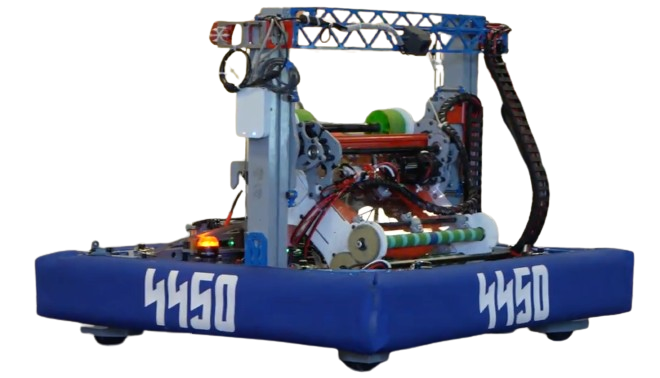

### Robot24 (Competition Code)
----------------------------------------------------------------------------
FRC Team 4450 2024 Robot Control program used in competition.

This is the 2024 competition robot control program created by the Olympia Robotics Federation (FRC Team 4450). 

Operates the robot **USS Protostar** for FRC game **CRESCENDO**.

### [Documentation can be found here](https://docs.google.com/document/d/1zERsIV9IP5XDU3M_6nbmJp7ZdcOXqVgWPSuCti4E938/edit?target=_blank)

----------------------------------------------------------------------------
## Instructions to setup development environment for VS Code
1) Follow the instructions [here](https://docs.wpilib.org/en/stable/docs/zero-to-robot/step-2/index.html) to setup the JDK, Visual Studio Code, the FRC plugins and tools. Do not install the C++ portion. You do not need the FRC Update Suite to compile code.
2) Clone this repository to local folder.
3) Open that folder in Visual Studio Code.
4) Build the project using the build project command from the WPILib commands list.

### If RobotLib gets an update:
Download the RobotLib.json file from the RobotLib Github repo and drop it into the vendordeps folder inside the project folder. Build the project.
********************************************************
Final Competition Version
* Final release of the 2024 ProtoStar Control Code
* Versions are tagged at `glacier_peak`, `auburn`, `pre_dcmp`, `dcmp`, and `cmp`.

C. Wilson, April 25 2024
*********************************************************
#### Special Credit
The vast majority of this code and the control concepts implmented by it, are the work of **Cole Wilson**, with
support from the software, build and drive teams of 4450.
****************************************************************************************************************
Version 24.1

*   Final 2024 competition version after Worlds (as noted above).

R. Corn, April 30 2024

Version 24.0

*   First release of 2024 Base Code.
*   Note that there was extensive development done between end of 2023 and this release. The history of
    that development is in the Robot24B project MaxSwerve2 branch.
 
R. Corn, February 6 2024
